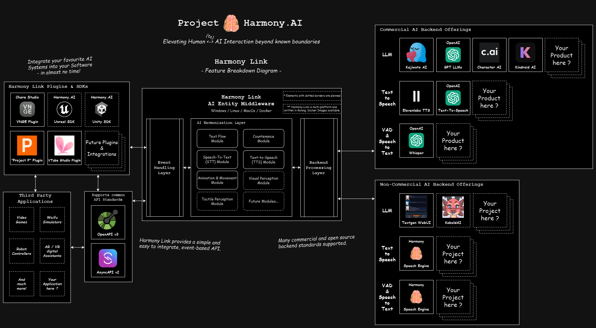
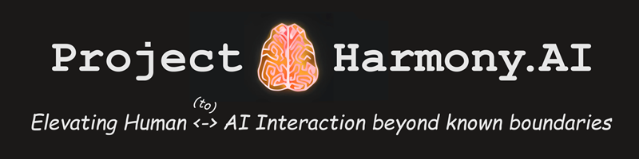

# Project Harmony.AI - Harmony Link

---

Harmony Link is a multi-platform AI-middleware, which allows for easy integration
of AI Agents into any kind of third party software, following our goal of elevating Human <-to-> AI Interaction 
beyond known boundaries.

***Using an innovative AI Harmonization Layer, Harmony Link de-facto achieves multi-modality between
distinct AI models.***

It is optimized for best latency and processing times. Therefore, AI Agents using Harmony Link excell at
tasks involving Real-Time-Conversation and simple use cases of Human <-to-> AI Interaction already today.

If you're curious for a little demonstration, please check out our Tech Demo on Youtube:

However, this is just a small fraction of features which we actually aim for with this project.
Therefore, our current development efforts for Harmony Link aim towards adding additional capabilities of
perception (e.g. visual), as well as adding controlled motion and countenance mechanics to AI Agents using
Harmony Link, to minimize the uncanny valley.

*Harmony Link is provided as a free - but not open source - piece of software, which can be easily integrated*
*into new or existing projects by utilizing our simple events API and SDKs.*

*For more details about the project as well as how you can support and get in touch with us, see*
*[About Project Harmony.AI](#about-project-harmonyai) and [How to reach out](#how-to-reach-out-to-us) below.*

A tutorial video with basic setup instructions can be found here:

## Announcements & News
- 2025-04-12: **Version 0.2.1** released, including a brand new Speech Inference Engine, fully local AI setup using docker,
  open sourcing of our Harmony Speech V1 model, and a new Plugin for VTube Studio. For the full list of updates see our
  [Changelog](https://project-harmony.youtrack.cloud/articles/HARMONY-A-10/Releases-Changelog).
- 2024-06-08: **Version 0.2.0** released, featuring a new Config UI, improved Speech-To-Text under Windows, and basic Movement
  API support on Harmony-Link side. For the full list of updates see our
  [Changelog](https://project-harmony.youtrack.cloud/articles/HARMONY-A-10/Releases-Changelog).
- 2024-06-08: **[ProjectP-Plugin for Harmony Link](https://github.com/harmony-ai-solutions/projectp-harmony-link-plugin)** released.
- 2024-01-04: Our new **[Youtube-Channel](https://www.youtube.com/@Harmony-AI)** including the first official Tech Demo
  for Project Harmony is now live! Feel free to check it out.
- 2023-10-01: Our official [Project Website](https://project-harmony.ai/) was launched. Finally we have an official Home on the Web. :-)
- 2023-08-17: Our brand new [Patreon Page](https://patreon.com/harmony_ai) launched today. It will allow you to directly
  support our project efforts if you find our software useful.

## Quickstart
To get started quickly, please have a look at our [Quickstart guide](https://project-harmony.youtrack.cloud/articles/HARMONY-A-11/Getting-Started).

## Harmony Link - Technical Breakdown

### Modular AI Harmonization Layer

Harmony Link's character control engine called "AI Harmonization Layer" is designed to allow for the individual or
combined usage of different application modules which are powered by AI technology. Moreover, it is highly optimized
to achieve the best possible latency and is highly parallelizable, so it can handle multiple characters acting independent
of each other at the same time.

### Simple Events API
By providing a standardized Event system, Harmony Link enables developers to enrich their applications
or games with AI agent functionality - without making a fixed decision towards individual third-party technology
providers anymore. Instead of implementing a single provider's API, it's possible to switch between different
providers just by doing a small config change.

However, there's more: Harmony Link even allows for democratizing this choice down to the end user,
if the config is made accessible to them.

### Multi-Platform-Compatibility

Harmony Link is completely written in golang, which makes it highly flexible and compatible with almost any operating
system.

We might not provide binaries for each platform at this point since we're lacking capability and resources to
properly test them, but feel free to reach out to us in case you want to use Harmony Link on a platform not part of the
main release yet.

## Harmony Link - Documentation & Resources
For a detailed understanding of Harmony Link and the underlying concepts, as well as for getting started with development
please take a look at our [technical documentation](docs/README.md).

If you're curious which applications already support Harmony Link, check out the
[list of available Harmony Link plugins](docs/Plugins.md).

---

## About Project Harmony.AI

### Our goal: Elevating Human <-to-> AI Interaction beyond known boundaries.
Project Harmony.AI emerged from the idea to allow for a seamless living together between AI-driven characters and humans.
Since it became obvious that a lot of technologies required for achieving this goal are not existing or still very experimental,
the long term vision of Project Harmony is to establish the full set of technologies which help minimizing biological and
technological barriers in Human <-to-> AI Interaction.

### Our principles: Fair use and accessibility
We want to counter today's tendencies of AI development centralization at the hands of big
corporations. We're pushing towards maximum transparency in our own development efforts, and aim for our software to be
accessible and usable in the most democratic ways possible.

Therefore, for all our current and future software offerings, we'll perform a constant and well-educated evaluation whether
we can safely open source them in parts or even completely, as long as this appears to be non-harmful towards achieving
the project's main goal.

In case of Harmony Link however, we currently feel like open-sourcing our code and therefore know-how could harm the above goal.
Once this Project and Harmony Link have matured some more, we will reconsider going full open source with it's code as well.

Nevertheless, **Harmony Link itself will always be free of charge**. 

Also we're distributing the Binaries under the Apache 2 License, which allows everyone to use the software as part of their 
own projects without any restrictions from our side.

Also, we're constantly striving to keep our software offerings as accessible as possible when it comes to services which
cannot be run or managed by everyone - For example our Harmony Speech TTS Engine. As long as this project exists,
we'll be trying out utmost to provide free tiers for personal and public research use of our software and APIs.

However, at the same time we'll also ensure everyone who supports us or actively joins forces with us on our journey, gets
something proper back in turn. Therefore we're also maintaining a Patreon Page with different supporter tiers, as we are
open towards collaboration with other businesses.

### How to reach out to us

[Official Website of Project Harmony.AI](https://project-harmony.ai/)

#### If you want to collaborate or support this Project financially:

Feel free to join our Discord Server and / or subscribe to our Patreon - Even $1 helps us drive this project forward.

 [Harmony.AI Discord Server](https://discord.gg/f6RQyhNPX8)

 [Harmony.AI Patreon](https://patreon.com/harmony_ai)

#### If you want to use our software commercially or discuss a business or development partnership:

Contact us directly via: [contact@project-harmony.ai](mailto:contact@project-harmony.ai)

---
&copy; 2023-2024 Harmony AI Solutions & Contributors

*Harmony Link Binaries are licensed and distributed under the Apache 2.0 License*